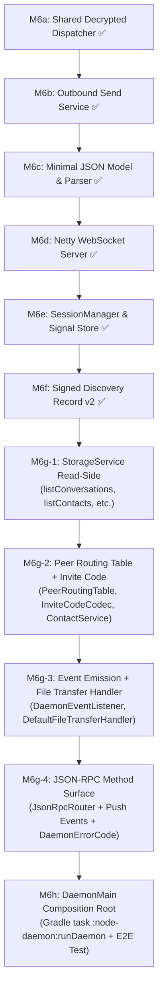

# M6 Architecture, Design Decisions & Implementation Roadmap

This document captures the finalized architectural decisions, cryptographic persistence design, and step-by-step implementation roadmap for **M6** (`node-daemon` composition root + local JSON-RPC/WebSocket API).

---

## 1. Architectural Principles & Key Findings

1. **Primitives Reuse**: All core components from M0–M5 (`PeerNetworkService`, `ConnectionStrategy`, `DialableAddressResolver`, `SecureSessionService`, `SqliteStorageService`, `HybridLogicalClock`, `ChatMessageCodec`, `FileTransferMessageCodec`) remain intact. M6 is a service composition pass.
2. **Disjoint Wire Codec Markers**: Chat message markers (`{2, 3, 4}`) and File Transfer markers (`{6, 7, 8}`) are disjoint and share the numeric space defined in `architecture-spec.md §6`. Decrypted frame dispatch does not require an outer `Envelope` wrapper—a thin router can peek `plaintext[0]` and delegate to the appropriate codec.
3. **Canonical Identity**: The **libp2p Peer ID** (`12D3KooW...`) is the canonical runtime identity for routing, multiaddrs, conversation IDs (`direct-<peerA>-<peerB>`), discovery records, and API responses. The app-identity hex ID is local metadata only.
4. **Signal Store Thread-Safety**: `libsignal-client` store implementations access internal maps. In M6, multi-peer concurrent messaging requires a thread-safe wrapper (`SynchronizedSignalProtocolStore` or per-address locks) around the store.

---

## 2. Decided M6 Design Surface

| # | Topic | Decision / Recommendation | Architectural Rationale |
|---|---|---|---|
| **1** | **Canonical Identity** | `com.p2pchat.model.PeerId` (libp2p base58) | Uniform routing identity across network callbacks, storage foreign keys, and discovery. |
| **2** | **Decrypted Dispatch** | `ApplicationMessageRouter` in `node-daemon` | Inspects `plaintext[0]` marker byte; delegates to `ChatMessageCodec` or `FileTransferMessageCodec`. |
| **3** | **JSON & WebSocket** | Hand-rolled JSON + Netty WebSocket | Pure JDK JSON parser/writer for JSON-RPC 2.0. Netty `WebSocketServerProtocolHandler` for RFC 6455 transport (Netty is already on classpath). |
| **4** | **Session Persistence** | `SqliteSignalProtocolStore` (`V002` + `V003`) | Persistent SQLite BLOB tables for `SessionRecord`, `PreKeyRecord`, `SignedPreKeyRecord`, `KyberPreKeyRecord`, `IdentityKey`, and `signal_kyber_base_keys_seen`. Single-use OPKs are deleted on consumption (`DELETE FROM signal_pre_keys`), and Kyber base-key replays are rejected persistently across restarts via composite primary key `(kyber_prekey_id, signed_prekey_id, base_key)`. |
| **5** | **Discovery Records v2** | Signed Ed25519 Discovery Records | Carries addresses + pre-key bundle + relay preference + expiry, signed by publisher's `identity.key` and verified client-side on lookup. Prevents MITM prekey replacement attacks. |
| **6** | **Storage Transactions** | `StorageService.runInTransaction` | Wraps consolidated receive pipelines (upsert conversation → dedup check → save message → state update → enqueue receipt) atomically. |
| **7** | **Error Vocabulary** | Sealed RPC Error Enum | Standardized error codes: `PEER_UNREACHABLE`, `RELAY_UNAVAILABLE`, `MALFORMED_RECORD`, `CRYPTO_FAILURE`, `DUPLICATE_MESSAGE`, `STORAGE_FAILURE`, `INVALID_REQUEST`. |

---

## 3. Cryptographic Session Persistence (`V002__signal_store.sql` & `V003__kyber_base_key_replay.sql`)

To resolve OPK reuse, detect Kyber base-key replay across daemon restarts, and preserve Double Ratchet states, `core-storage` adds migrations `V002__signal_store.sql` and `V003__kyber_base_key_replay.sql`:

```sql
-- V002__signal_store.sql
CREATE TABLE IF NOT EXISTS signal_sessions (
    address         TEXT PRIMARY KEY,
    session_record  BLOB NOT NULL,
    updated_at      INTEGER NOT NULL
);

CREATE TABLE IF NOT EXISTS signal_pre_keys (
    prekey_id       INTEGER PRIMARY KEY,
    record          BLOB NOT NULL
);

CREATE TABLE IF NOT EXISTS signal_signed_pre_keys (
    signed_prekey_id INTEGER PRIMARY KEY,
    record           BLOB NOT NULL
);

CREATE TABLE IF NOT EXISTS signal_kyber_pre_keys (
    kyber_prekey_id INTEGER PRIMARY KEY,
    record          BLOB NOT NULL,
    used            INTEGER NOT NULL DEFAULT 0
);

CREATE TABLE IF NOT EXISTS signal_identities (
    address         TEXT PRIMARY KEY,
    identity_key    BLOB NOT NULL
);

-- V003__kyber_base_key_replay.sql
CREATE TABLE IF NOT EXISTS signal_kyber_base_keys_seen (
    kyber_prekey_id  INTEGER NOT NULL,
    signed_prekey_id INTEGER NOT NULL,
    base_key         BLOB NOT NULL,
    PRIMARY KEY (kyber_prekey_id, signed_prekey_id, base_key)
);
```

### Key Behaviors of `SqliteSignalProtocolStore`:
* **OPK Consumption**: `removePreKey(preKeyId)` executes `DELETE FROM signal_pre_keys WHERE prekey_id = ?`, physically deleting consumed one-time prekeys from disk.
* **Ratchet State**: `storeSession(...)` upserts `session_record` BLOB via `SessionRecord.serialize()`. `loadSession(...)` deserializes ratchets using `SessionRecord.deserialize(...)`.
* **Thread Safety**: All SPI calls are guarded by a thread-safe monitor wrapper (`SynchronizedSignalProtocolStore`).

---

## 4. Step-by-Step Build Order (M6a – M6h)



### Detailed Milestone Breakdown

#### **M6a — Shared Decrypted-Message Dispatch**
* **Goal**: Build `ApplicationMessageRouter` in `node-daemon`.
* **Logic**: Inspect `plaintext[0]`. If `2..4`, delegate to `ChatMessageCodec.decode()`. If `6..8`, delegate to `FileTransferMessageCodec.decode()`.
* **Verification**: Pure JDK unit tests with mocked/encoded wire byte payloads of all 6 message types.

#### **M6b — Outbound Send Service (`OutboundMessageService`)** ✅ (Verified)
* **Goal**: Create unified outbound sending service in `node-daemon`.
* **Logic**: Wrap `ConnectionStrategy` with `CompletableFuture.supplyAsync` on a dedicated thread pool. Handle timeouts with `orTimeout` and return `ConnectivityStatus` (`DIRECT`, `RELAYED`, `UNREACHABLE`). Offload sending off Netty event loop threads to prevent callback deadlocks. Catch `RejectedExecutionException` defensively if called during or after shutdown.
* **Verification**: 9/9 unit tests in `OutboundMessageServiceTest` covering direct-send success off-thread, fallback to relay on direct failure, skipping straight to relay when direct address is null, timeout handling on hung direct or relay attempts, non-blocking caller execution, concurrent sends, and clean shutdown handling.

#### **M6c — Minimal JSON Value Model & Parser** ✅ (Verified)
* **Goal**: Build lightweight, zero-dependency JSON parser/serializer in `node-daemon` (`JsonValue`, `JsonObject`, `JsonArray`, `JsonString`, `JsonNumber`, `JsonBoolean`, `JsonNull`, `JsonCodec`).
* **Logic**: Pure JDK recursive-descent parser and serializer matching RFC 8259. Strict number grammar with lossless raw representation (prevents $2^{53}+1$ float truncation), UTF-16 surrogate pair preservation for supplementary plane characters (e.g. emojis), control character escaping, last-value-wins for duplicate keys, insertion-order preservation via `LinkedHashMap`, defensive max nesting depth guard (32 levels) to prevent stack exhaustion, and non-coercive narrowing accessors. Deliberately scoped to the generic JSON layer only (no JSON-RPC envelope coupling until M6g).
* **Verification**: 36/36 unit tests in `JsonCodecTest` covering round-trip serialization, nested arrays/objects, insertion order, number precision, surrogate pairs, malformed input rejection, depth limit enforcement, and narrowing type accessors.

#### **M6d — Netty WebSocket Server Transport** ✅ (Verified)
* **Goal**: Implement `DaemonWebSocketServer` using Netty's `WebSocketServerProtocolHandler` (RFC 6455).
* **Logic**: Listen on `ws://127.0.0.1:<port>/v1` (default path `/v1`), handle HTTP to WebSocket upgrades, track active client sessions (`WebSocketSession`), forward inbound `TextWebSocketFrame` payloads to `WebSocketTextHandler`, and provide `broadcast(text)` / `session.send(text)` for pushing JSON-RPC responses and server events. Configured with dedicated `EventLoopGroup`s, `allowExtensions = false`, and auto-handling of ping/pong/close frames upstream by Netty. Added `io.netty:netty-codec-http:4.2.10.Final` dependency directly to `node-daemon/build.gradle.kts`.
* **Verification**: Unit tests in `DaemonWebSocketFrameHandlerTest` using Netty's `EmbeddedChannel` verifying session registration on handshake complete, text frame forwarding to `onMessage`, message suppression prior to handshake completion, and session cleanup on channel disconnect.

#### **M6e — SessionManager Core & SQLite Session Store** ✅ (Verified)
* **Goal**: Build the daemon application core (`SessionManager`) and `SqliteSignalProtocolStore` (`M6e-1` + `M6e-2`).
* **Logic**: Apply `V002__signal_store.sql` & `V003__kyber_base_key_replay.sql`. Implement persistent Signal store for ratchets, prekeys, and identity keys (`M6e-1`). Wrap store in `SynchronizedSignalProtocolStore`. Build `SessionManager` (`M6e-2`) as the long-running daemon core: manages multi-peer sessions concurrently, coordinates inbound envelope decryption with `SecureSessionService`, dispatches chat/file payloads via `ApplicationMessageRouter`, enforces storage transaction boundaries (atomic conversation upsert + message persistence), enforces single-threaded inbound dedup, sends automatic delivery receipts, and coordinates outbound sends through `OutboundMessageService`.
* **Verification**:
  - `M6e-1`: 22/22 tests in `SqliteSignalProtocolStoreTest` verifying OPK deletion, cross-restart Double Ratchet survival, and multi-thread concurrency.
  - `M6e-2`: 4/4 tests in `SessionManagerReceivePipelineTest` verifying message persistence, duplicate rejection with re-acknowledgment, and delivery/read receipt state updates against real SQLite.
  - Live Multi-Session Proof: Executed `SessionManagerListenerMain` while concurrently serving multiple distinct senders (`SessionManagerSenderMain` from separate data directories) over real libp2p + PQXDH Double Ratchet transport with automatic delivery receipts. Concrete gap surfaced by this testing, not by review: the listener publishes one pre-key bundle to a static file once, at startup, never regenerated — a later sender reads the same already-consumed one-time prekey an earlier sender's handshake already used. The rejection itself is real and correct either way (the store doesn't care why the OPK is gone); this is a demo-only limitation, not a `SessionManager` bug, and it's the concrete instance of the pre-key-lifecycle deferral named above. Explicitly carried forward: M6f's own design had to decide how a record's bundle gets *refreshed*, not only how it gets *signed* — see M6f's own "explicitly out of scope" note below for how that constraint was actually honored, not just repeated.

#### **M6f — Signed Discovery Record v2** ✅ (Verified)
* **Goal**: Upgrade discovery records in `core-network` and `relay-server`.
* **Logic**: New `core-discovery` module (deliberately not folded into `core-network` — see its own `build.gradle.kts` for the dependency reasoning). `DiscoveryRecord` (addresses, optional pre-key bundle, optional relay preference, expiry) + `SignedDiscoveryRecord`/`DiscoveryRecordCodec` (hand-rolled length-prefixed binary codec, matching every other wire codec in this project — not JSON), signed with the publisher's raw Ed25519 identity-key seed and verified client-side by checking that the embedded public key's derived peer ID matches the one being looked up. That check needed `Ed25519RecordKeys`: a from-scratch, pure-JDK derivation of libp2p's peer-ID-from-Ed25519-key algorithm, since core-discovery deliberately carries no jvm-libp2p dependency. `DiscoveryRegistry` (`relay-server`) gained a best-effort expiry peek — not a signature check, since the relay was never this system's trust boundary; the client-side check above is the actual, load-bearing MITM defense. Two new demo Mains, `PublishSignedRecordMain`/`LookupSignedRecordMain`, alongside (not replacing) M3c's unsigned-record ones.
* **Verification**: 19/19 real, executed checks — not hand-traced, not stub-compiled — run against the actual production source via a standalone harness (this sandbox has no Maven Central access for JUnit/AssertJ; the equivalent `Ed25519RecordKeysTest`/`DiscoveryRecordCodecTest`/`DiscoveryRegistryTest` JUnit files are included for a real `./gradlew test` run). Covers: the *official* libp2p peer-id spec's own published Ed25519 test vector (byte-for-byte match), 5 real JDK-generated keypairs round-tripped through X.509 extraction, signing, and verification, full record round-trip (populated and minimal), tampered-record rejection, cross-peer signature substitution rejection (`PEER_ID_MISMATCH` — the actual MITM scenario this milestone exists to close), expired-record rejection, truncated/garbage/implausible-count input rejection, `decodeUnverified`'s deliberate non-verification, and `DiscoveryRegistry`'s expiry-withholding including backward compatibility with pre-M6f (non-V2) payloads.
* **Explicitly out of scope, named rather than silently dropped**: pre-key bundle *refresh cadence* — the concrete gap M6e-2 testing surfaced above. The record format doesn't block a fix (`publish()` is a plain overwrite; republishing a fresh signed record is just calling this code again), but nothing yet decides *when* to call it — that needs a live daemon loop to run a schedule from, which doesn't exist until M6g/M6h. Not solved here; said so, on purpose.

#### **M6g — JSON-RPC Method Surface, Push Events & Error Vocabulary (revised)**

> **Revised post-M6f:** A gap analysis (`docs/M6g-gap-analysis-and-plan.md`) revealed that M6g's original scope assumed backend capabilities that don't exist yet. M6g is split into four sub-milestones following the M6e-1/M6e-2 precedent.

##### M6g-1 — StorageService Read-Side Expansion ✅ (Verified)
* **Goal**: Fill the read-side gaps in `StorageService` that every `*.list` RPC method needs.
* **New methods**: `listConversations()`, `listContacts()`, `getConversation(String)`, `getContact(PeerId)`.
* **Scope**: Pure SQL reads against existing tables. Bundled with HLC clock-drift regression fix.
* **Verification**: Unit tests in `SqliteStorageServiceTest` against real in-memory SQLite (14/14).

##### M6g-2 — Peer Routing Table + Invite Code Resolution ✅ (Verified)
* **Goal**: Build the peer-resolution layer that `messages.send` and `contacts.add` need.
* **New code**: `PeerRoute` record (in `core-storage.model`), `PeerRoutingTable`, `V004__peer_routes.sql` migration, `InviteCodeCodec` (base64url JSON: peer ID + optional discovery addr + optional display name), `ContactService` (orchestrates `contacts.add`: decode → discovery lookup → verify signed record → save contact → populate routing table).
* **Verification**: Unit tests for `InviteCodeCodec` (7/7), `PeerRoutingTable` (4/4, including restart survival across database reopen), and `ContactService` (8/8).

##### M6g-3 — SessionManager Event Emission + FileTransferHandler Implementation ✅ (Verified)
* **Goal**: Give `SessionManager` a way to notify the WebSocket/JSON-RPC layer, and wire in the file-transfer lifecycle.
* **New code**: `DaemonEventListener` interface (`onMessageReceived`, `onDeliveryStateChanged`, `onFileOfferReceived`, `onFileTransferProgress`, `onNetworkStatusChanged`). `SessionManager` gains event emission call sites, `sendFile(PeerId, Path, String direct, String relay)`, and `acceptFileTransfer(transferId, savePath)`. `DefaultFileTransferHandler` consolidates `FileSenderMain`/`FileReceiverMain`'s proven chunk logic with an accept gate, thread synchronization, and `outgoingTransfers` TTL eviction (24h). Complete lifecycle state handling in `onFileOffer` (`COMPLETED` deduplication, `FAILED` retry via atomic `resetChunkState` in `StorageService`, and partial crash resumption).
* **Scope note**: `files.cancel` deferred to M7.
* **Verification**: 9/9 `DefaultFileTransferHandlerTest` scenarios, 9/9 `SessionManagerReceivePipelineTest` cases, and 18/18 `SqliteStorageServiceTest` cases (39/39 tasks green repository-wide).

##### M6g-4 — JSON-RPC Router, Method Dispatch, Push Events, Error Vocabulary
* **Goal**: The original M6g scope — now buildable because M6g-1 through M6g-3 provided everything it needs.
* **New code**: `JsonRpcRequest`/`JsonRpcResponse`/`JsonRpcError` records (on top of M6c's `JsonValue`/`JsonCodec`). `DaemonErrorCode` enum (`PEER_UNREACHABLE`, `RELAY_UNAVAILABLE`, `MALFORMED_RECORD`, `CRYPTO_FAILURE`, `DUPLICATE_MESSAGE`, `STORAGE_FAILURE`, `INVALID_REQUEST`, `METHOD_NOT_FOUND`, `UNKNOWN_CONVERSATION`, `UNKNOWN_CONTACT`). `JsonRpcRouter` implements both `WebSocketTextHandler` (request dispatch) and `DaemonEventListener` (push event emission via `DaemonWebSocketServer.broadcast`).
* **Method names**: §7's original namespace (`messages.send`, `messages.history`, etc.), not the M6-roadmap's earlier alternatives. `conversations.createGroup` returns `METHOD_NOT_FOUND` ("available in a future version") until M8. `files.cancel` returns `METHOD_NOT_FOUND` until M7.
* **Verification**: Unit tests for JSON-RPC envelope parsing, each method handler (mock backend), error formatting, and push event content.

#### **M6h — `DaemonMain` Composition Root & Automated E2E Test**
* **Goal**: Assemble the complete daemon process and Gradle task `:node-daemon:runDaemon`.
* **Logic**: Wire `DaemonWebSocketServer` + `JsonRpcRouter` + `SessionManager` + `OutboundMessageService` + `SqliteStorageService` + `Libp2pNetworkService` + `PeerRoutingTable` + `ContactService` + `DefaultFileTransferHandler` + `DaemonEventListener` in `DaemonMain`. Also picks up the deferred items from M6e-2 that require a live daemon loop: relay-delivered inbound reception (wire `SessionManager` as `RelayEventHandler`), pre-key bundle refresh cadence (scheduled republication of signed discovery records), and the automated E2E integration test (two daemon processes exchange chat messages and file transfers via JSON-RPC).
* **Verification**: Automated integration test confirming full end-to-end functionality across two daemon processes.

