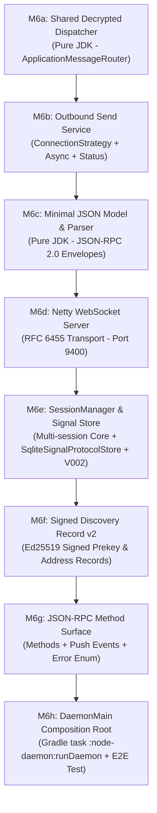

# M6 Architecture, Design Decisions & Implementation Roadmap

This document captures the finalized architectural decisions, cryptographic persistence design, and step-by-step implementation roadmap for **M6** (`node-daemon` composition root + local JSON-RPC/WebSocket API).

---

## 1. Architectural Principles & Key Findings

1. **Primitives Reuse**: All core components from M0–M5 (`PeerNetworkService`, `ConnectionStrategy`, `DialableAddressResolver`, `SecureSessionService`, `SqliteStorageService`, `HybridLogicalClock`, `ChatMessageCodec`, `FileTransferMessageCodec`) remain intact. M6 is a service composition pass.
2. **Disjoint Wire Codec Markers**: Chat message markers (`{2, 3, 4}`) and File Transfer markers (`{6, 7, 8}`) are disjoint and share the numeric space defined in `architecture-spec.md §6`. Decrypted frame dispatch does not require an outer `Envelope` wrapper—a thin router can peek `plaintext[0]` and delegate to the appropriate codec.
3. **Canonical Identity**: The **libp2p Peer ID** (`12D3KooW...`) is the canonical runtime identity for routing, multiaddrs, conversation IDs (`direct-<peerA>-<peerB>`), discovery records, and API responses. The app-identity hex ID is local metadata only.
4. **Signal Store Thread-Safety**: `libsignal-client` store implementations access internal maps. In M6, multi-peer concurrent messaging requires a thread-safe wrapper (`SynchronizedSignalProtocolStore` or per-address locks) around the store.

---

## 2. Decided M6 Design Surface

| # | Topic | Decision / Recommendation | Architectural Rationale |
|---|---|---|---|
| **1** | **Canonical Identity** | `com.p2pchat.model.PeerId` (libp2p base58) | Uniform routing identity across network callbacks, storage foreign keys, and discovery. |
| **2** | **Decrypted Dispatch** | `ApplicationMessageRouter` in `node-daemon` | Inspects `plaintext[0]` marker byte; delegates to `ChatMessageCodec` or `FileTransferMessageCodec`. |
| **3** | **JSON & WebSocket** | Hand-rolled JSON + Netty WebSocket | Pure JDK JSON parser/writer for JSON-RPC 2.0. Netty `WebSocketServerProtocolHandler` for RFC 6455 transport (Netty is already on classpath). |
| **4** | **Session Persistence** | `SqliteSignalProtocolStore` (`V002` + `V003`) | Persistent SQLite BLOB tables for `SessionRecord`, `PreKeyRecord`, `SignedPreKeyRecord`, `KyberPreKeyRecord`, `IdentityKey`, and `signal_kyber_base_keys_seen`. Single-use OPKs are deleted on consumption (`DELETE FROM signal_pre_keys`), and Kyber base-key replays are rejected persistently across restarts via composite primary key `(kyber_prekey_id, signed_prekey_id, base_key)`. |
| **5** | **Discovery Records v2** | Signed Ed25519 Discovery Records | Carries addresses + pre-key bundle + relay preference + expiry, signed by publisher's `identity.key` and verified client-side on lookup. Prevents MITM prekey replacement attacks. |
| **6** | **Storage Transactions** | `StorageService.runInTransaction` | Wraps consolidated receive pipelines (upsert conversation → dedup check → save message → state update → enqueue receipt) atomically. |
| **7** | **Error Vocabulary** | Sealed RPC Error Enum | Standardized error codes: `PEER_UNREACHABLE`, `RELAY_UNAVAILABLE`, `MALFORMED_RECORD`, `CRYPTO_FAILURE`, `DUPLICATE_MESSAGE`, `STORAGE_FAILURE`, `INVALID_REQUEST`. |

---

## 3. Cryptographic Session Persistence (`V002__signal_store.sql` & `V003__kyber_base_key_replay.sql`)

To resolve OPK reuse, detect Kyber base-key replay across daemon restarts, and preserve Double Ratchet states, `core-storage` adds migrations `V002__signal_store.sql` and `V003__kyber_base_key_replay.sql`:

```sql
-- V002__signal_store.sql
CREATE TABLE IF NOT EXISTS signal_sessions (
    address         TEXT PRIMARY KEY,
    session_record  BLOB NOT NULL,
    updated_at      INTEGER NOT NULL
);

CREATE TABLE IF NOT EXISTS signal_pre_keys (
    prekey_id       INTEGER PRIMARY KEY,
    record          BLOB NOT NULL
);

CREATE TABLE IF NOT EXISTS signal_signed_pre_keys (
    signed_prekey_id INTEGER PRIMARY KEY,
    record           BLOB NOT NULL
);

CREATE TABLE IF NOT EXISTS signal_kyber_pre_keys (
    kyber_prekey_id INTEGER PRIMARY KEY,
    record          BLOB NOT NULL,
    used            INTEGER NOT NULL DEFAULT 0
);

CREATE TABLE IF NOT EXISTS signal_identities (
    address         TEXT PRIMARY KEY,
    identity_key    BLOB NOT NULL
);

-- V003__kyber_base_key_replay.sql
CREATE TABLE IF NOT EXISTS signal_kyber_base_keys_seen (
    kyber_prekey_id  INTEGER NOT NULL,
    signed_prekey_id INTEGER NOT NULL,
    base_key         BLOB NOT NULL,
    PRIMARY KEY (kyber_prekey_id, signed_prekey_id, base_key)
);
```

### Key Behaviors of `SqliteSignalProtocolStore`:
* **OPK Consumption**: `removePreKey(preKeyId)` executes `DELETE FROM signal_pre_keys WHERE prekey_id = ?`, physically deleting consumed one-time prekeys from disk.
* **Ratchet State**: `storeSession(...)` upserts `session_record` BLOB via `SessionRecord.serialize()`. `loadSession(...)` deserializes ratchets using `SessionRecord.deserialize(...)`.
* **Thread Safety**: All SPI calls are guarded by a thread-safe monitor wrapper (`SynchronizedSignalProtocolStore`).

---

## 4. Step-by-Step Build Order (M6a – M6h)



### Detailed Milestone Breakdown

#### **M6a — Shared Decrypted-Message Dispatch**
* **Goal**: Build `ApplicationMessageRouter` in `node-daemon`.
* **Logic**: Inspect `plaintext[0]`. If `2..4`, delegate to `ChatMessageCodec.decode()`. If `6..8`, delegate to `FileTransferMessageCodec.decode()`.
* **Verification**: Pure JDK unit tests with mocked/encoded wire byte payloads of all 6 message types.

#### **M6b — Outbound Send Service (`OutboundMessageService`)** ✅ (Verified)
* **Goal**: Create unified outbound sending service in `node-daemon`.
* **Logic**: Wrap `ConnectionStrategy` with `CompletableFuture.supplyAsync` on a dedicated thread pool. Handle timeouts with `orTimeout` and return `ConnectivityStatus` (`DIRECT`, `RELAYED`, `UNREACHABLE`). Offload sending off Netty event loop threads to prevent callback deadlocks. Catch `RejectedExecutionException` defensively if called during or after shutdown.
* **Verification**: 9/9 unit tests in `OutboundMessageServiceTest` covering direct-send success off-thread, fallback to relay on direct failure, skipping straight to relay when direct address is null, timeout handling on hung direct or relay attempts, non-blocking caller execution, concurrent sends, and clean shutdown handling.

#### **M6c — Minimal JSON Value Model & Parser**
* **Goal**: Build lightweight, zero-dependency JSON parser/serializer in `node-daemon`.
* **Logic**: Parse and serialize JSON-RPC 2.0 requests, responses, and notification events. Handle string escaping, numbers, booleans, arrays, objects, and nulls defensively.
* **Verification**: Pure JDK unit tests covering round-trip serialization, escaping, and malformed JSON rejection.

#### **M6d — Netty WebSocket Server Transport**
* **Goal**: Implement `DaemonWebSocketServer` using Netty's `WebSocketServerProtocolHandler`.
* **Logic**: Listen on port `9400` (configurable), handle HTTP upgrades, read text frames, pass raw JSON to `JsonRpcRouter`, and push events back to connected WebSocket clients.
* **Verification**: Integration test connecting a local WebSocket client and exchanging frames.

#### **M6e — SessionManager Core & SQLite Session Store**
* **Goal**: Build the daemon application core (`SessionManager`) and `SqliteSignalProtocolStore`.
* **Logic**: Apply `V002__signal_store.sql`. Implement persistent Signal store for ratchets, prekeys, and identity keys. Wrap store in `SynchronizedSignalProtocolStore`. Wire canonical `PeerId` routing and storage transaction boundaries.
* **Verification**: Unit tests verifying OPK deletion upon consumption, Double Ratchet state survival across simulated database restarts, and multi-thread concurrency.

#### **M6f — Signed Discovery Record v2**
* **Goal**: Upgrade discovery records in `core-network` and `relay-server`.
* **Logic**: Structure `DiscoveryRecordV2` carrying multiaddrs, pre-key bundle, relay preference, and expiry timestamp. Sign payload with publisher's Ed25519 `identity.key`. Verify signature client-side on lookup using the raw Ed25519 public key.
* **Verification**: Unit tests verifying signature generation, valid verification, and tampered record rejection.

#### **M6g — JSON-RPC Method Surface, Push Events & Error Vocabulary**
* **Goal**: Implement `JsonRpcRouter` and standard methods/events.
* **Logic**: Map RPC methods (`chat.send`, `chat.listMessages`, `file.offer`, `peers.discover`) and server push events (`event.messageReceived`, `event.deliveryStateChanged`, `event.fileProgress`). Map failures to the sealed `DaemonErrorCode` enum.
* **Verification**: Unit tests testing method invocation, parameter extraction, error response formatting, and push event emission.

#### **M6h — `DaemonMain` Composition Root & Automated E2E Test**
* **Goal**: Assemble the complete daemon process and Gradle task `:node-daemon:runDaemon`.
* **Logic**: Wire `DaemonWebSocketServer` + `JsonRpcRouter` + `SessionManager` + `OutboundMessageService` + `SqliteStorageService` + `Libp2pNetworkService` in `DaemonMain`. Create an end-to-end integration test where two daemon processes exchange chat messages and file transfers via JSON-RPC.
* **Verification**: Automated integration test execution confirming full end-to-end functionality.
